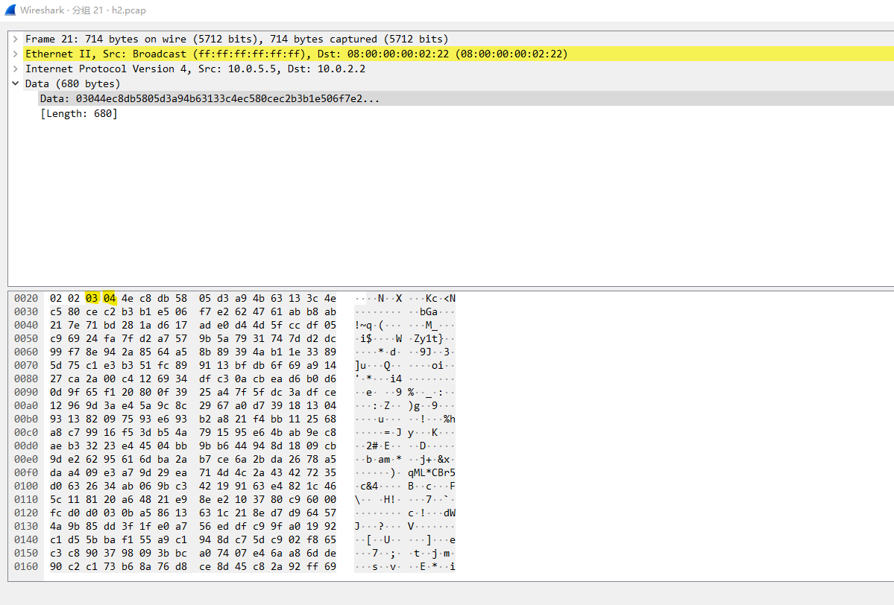
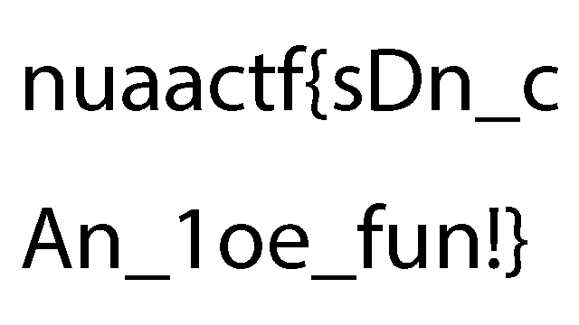

# Babysdn
## 描述
网络领域有个很火的研究领域叫做SDN，那么你知道SDN可以做什么吗？

## flag
`nuaactf{sDn_cAn_1oe_fun!}`

## WP
本题作为Misc题来说本身是非常简单的，主要目的是让大家简单了解一下SDN，这是网络领域一个非常有趣的研究方向。作为SDN领域的代表，P4语言非常火，因此这里也将其作为代表让大家领略一下SDN的魅力。

题目附件中，主要需要分析的是babysdn.p4这个文件，要想看到这个文件需要先了解一下P4语言的语法。在官网上有一个文档全面的介绍了[P4-16](https://p4.org/p4-spec/docs/P4-16-v1.2.0.html)，但是在比赛中要想看完这个是不太可能的。最简单的方法是看一看[官方教程](https://github.com/p4lang/tutorials)，实际上本题目也是在官方教程提供的VM中制作的。

了解了P4的基本语法后，要想完成此题就已经非常简单了。在`babysdn.p4`文件中，可以找到一个比较有意思的结构体`funnydata_t`。
```
header funnydata_t {
    bit<8> prev;
    bit<8> curr;
    bit<DATA_SIZE> data;
}
```
看到这个名字也应该能判断这是题目的关键，对整个文件分析后可以发现，本题实现了一个自定义的传输层协议，IPv4头部的协议号定为`0x66`。bmv2交换机收到这个报文后，会按照顺序调用`parse_ipv4`和`parse_funnydata`，按照结构体的定义解析出对应的字段。Ingress过程中没有处理该类型的报文，而Egress时，可以找到如下的逻辑。
```
control MyEgress(inout headers hdr,
                 inout metadata meta,
                 inout standard_metadata_t standard_metadata) {

    register<bit<8>>(1) last_funnydata_index;
    register<bit<DATA_SIZE>>(1) last_funnydata_data;

    apply {
        bit<8> last;
        bit<DATA_SIZE> data;

        if (hdr.funnydata.isValid()) {
            last_funnydata_index.read(last, 0);
            hdr.funnydata.prev = last;
            last_funnydata_index.write(0, hdr.funnydata.curr);

            last_funnydata_data.read(data, 0);
            last_funnydata_data.write(0, hdr.funnydata.data);
            hdr.funnydata.data = data ^ hdr.funnydata.data;
        }
    }
}
```
这个逻辑非常简单，两个变量存储了上一个`funnydata`报文中的index和data，处理时将本次的data与上次保存的data进行异或，并更新头部中的`prev`字段。那么，经过该bmv2的`funnydata`报文序列，如果是
```
+------+------+-----------------+
| prev | curr |       data      |
+------+------+-----------------+
|   0  |   1  |      data1      |
+------+------+-----------------+
|   0  |   2  |      data2      |
+------+------+-----------------+
|   0  |   3  |      data3      |
+------+------+-----------------+
```
处理后应该会变成
```
+------+------+-----------------+
| prev | curr |      data       |
+------+------+-----------------+
|   0  |   1  |      data1      |
+------+------+-----------------+
|   1  |   2  |  data1 ^ data2  |
+------+------+-----------------+
|   2  |   3  |  data2 ^ data3  |
+------+------+-----------------+
```

知道这个逻辑后这道题已经基本算完成了，下面只需要按照这个逻辑还原所有的data即可。在`pod-topo`中找到`topology.json`文件描述了题目的星状网络拓扑结构，非常简单。
```
     h3
      |
h1 - s1 - h2
    /  \
   h4  h5 
```
在`pcap`文件夹下找到每一个主机节点的流量，分析pcap文件后可以找到`funnydata`。例如下面这个

按照`funnydata_t`的结构人工分析一下，可以知道这个报文的`prev`为`3`，`next`为`4`，后面是`data`。

将5个pcap文件中的关键报文提取出来，按照异或的逻辑反向处理，可以得到全部5个部分的data。
组合起来很容易发现里面有PNG文件的关键字。拼接后得到flag。
